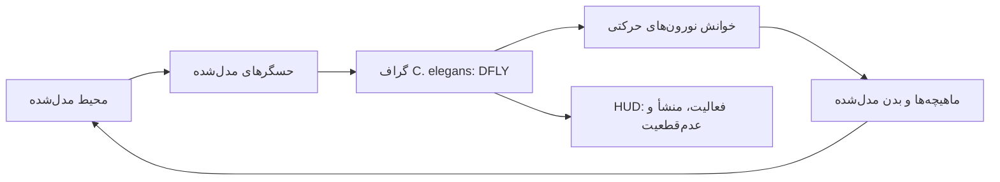

# طرح ادغام کرم مجازی C. elegans در My Greatest Sin

## تصمیم معماری

نسخهٔ بعدی پروژه باید یک **کرم مجازیِ تعاملی** باشد، نه ادعای بازسازی یک جانور زنده. «زنده‌نما» در این سند یعنی مشاهدهٔ پیوستهٔ وضعیت عصبی، حس، فعال‌شدن ماهیچه و حرکت مدل‌شده در یک محیط؛ نه آگاهی، اراده، درد، بقا یا صحت زیست‌شناختی کامل.

> «اتصال‌نگار» یک ساختار مشاهده‌شده است؛ تبدیل آن به دینامیک عصبی و رفتار، ناگزیر به فرض‌ها و پارامترهای مدل نیاز دارد.

## ورودی‌های مجاز نسخهٔ اول

| لایه | منبع پیشنهادی | کاربرد در پروژه | الزام انتساب/مرز |
|---|---|---|---|
| گراف عصبی | دادهٔ اتصالی C. elegans از OpenWorm/c302 و WormAtlas | ساخت `DFLY` کوچک با نورون‌ها، اتصالات شیمیایی و junctionهای الکتریکی. | منبع دقیق فایل و نسخه در manifest ثبت می‌شود. |
| کالبد | نقشهٔ سه‌بعدی/NeuroML OpenWorm | مختصات و گروه‌بندی نورون‌ها برای نمایش. | هندسه فقط بازنمایی مدل است. |
| عضله | نگاشت نورون–ماهیچهٔ WormAtlas/OpenWorm | تبدیل خروجی نورون‌های حرکتی به فعال‌سازی بخش‌های بدن. | نگاشت‌های تقریبی جداگانه برچسب می‌خورند. |
| محیط | مدل پروژه | حسگرهای نور، تماس و مواد شیمیایی و یک میدان فیزیکی ساده. | کاملاً `MODELLED MAPPING` است. |

## جریان اجرای پیشنهادی

## مراحل اجرا

| مرحله | خروجی قابل‌سنجش | شرط صداقت علمی |
|---|---|---|
| 1. تثبیت منبع | یک جدول منبع با URL، نسخه، مجوز، SHA-256 و citation. | هیچ فایل ثالثی بدون مجوز قابل‌اتکا وارد مخزن یا انتشار عمومی نمی‌شود. |
| 2. تبدیل DFLY | `manifest.json` و chunkهای کوچک برای C. elegans. | ستون‌های منبع و تبدیل جداگانه ثبت می‌شوند. |
| 3. موتور عصبی | اجرای قطعی شبکهٔ کامل در CPU worker، با pause/reset/step. | پارامترهای LIF یا هر مدل جایگزین، `MODELLED MAPPING` هستند. |
| 4. بدن کرم | بدنهٔ چندبخشی با ماهیچه‌های چپ/راست و solver موجیِ ساده. | حرکت، نتیجهٔ decoder مدل‌شده است نه فیلم یا ادعای حرکت واقعی. |
| 5. حس و رفتار | فوتوتاکسی، لمس و گرادیان شیمیایی در محیط کوچک. | هر حسگر نگاشت صریح به نورون‌ها و دسترسی‌پذیری دارد. |
| 6. آزمون | replay تعیین‌پذیر، تست گراف، تست خروجی عضله، و مقایسهٔ رفتار در سناریوهای ثابت. | موفقیت به معنی اعتبار زیستی کامل نیست. |

## تغییرات پیشنهادی در کد

| بخش فعلی | تغییر |
|---|---|
| `scripts/data-processing/` | افزودن تبدیل‌کنندهٔ ورودی C. elegans به `DFLY` با ثبت منبع/مجوز و تست دادهٔ کوچک رسمی. |
| `client/src/game/connectome/` | افزودن پروفایل `c-elegans-v1` در کنار قرارداد عمومی DFLY. |
| `client/src/game/` | افزودن `WormBody`، `WormSensors` و `WormMotorDecoder` با آرایه‌های ازپیش‌تخصیص‌یافته. |
| `SimulationHud.tsx` | جایگزینی وضعیت fixture با برچسب‌های `SOURCE DATA`، `MODELLED MAPPING` و `SYNTHETIC TEST FIXTURE`. |
| تست‌ها | آزمون SHA-256، تعداد نورون/یال، تکرارپذیری گام‌ها و نگاشت خروجی حرکتی. |

## معیار پذیرش

نسخهٔ C. elegans فقط زمانی کامل محسوب می‌شود که گراف کاملِ انتخاب‌شده، منشأ و checksum قابل‌خواندن، کنترل‌های اجرای قطعی، بدن واکنش‌پذیر، و هر سه مرز `SOURCE DATA`، `MODELLED MAPPING` و `SYNTHETIC TEST FIXTURE` را به‌طور قابل مشاهده نمایش دهد.

## منابع

[1] [OpenWorm — Data Collection and Representation](https://docs.openworm.org/Projects/datarep/)

[2] [openworm/c302 — MIT-licensed modelling framework](https://github.com/openworm/c302)

[3] [WormAtlas — Neuronal Wiring](https://www.wormatlas.org/neuronalwiring.html)
