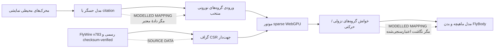

# مسیر فعال‌سازی علمی FlyWire برای My Greatest Sin

## پاسخ کوتاه

فعال‌کردن **دادهٔ عصبی واقعی FlyWire** امکان‌پذیر است، اما به‌تنهایی باعث نمی‌شود حرکت مگس «کاملاً منطبق با واقعیت» شود. FlyWire FAFB v783 یک اتصال‌نگار ساختاریِ ایستا از مغز مگس مادهٔ بالغ است؛ دادهٔ منتشرشده شامل نورون‌های proofread، اتصال‌های جهت‌دار، شمار سیناپس‌ها، نوراپیل و پیش‌بینی ناقل عصبی است، نه ثبت هم‌زمان حس‌های یک مگس زنده، فعالیت الکتروفیزیولوژیک، وضعیت ماهیچه‌ها یا سینماتیک بدن [1] [2].

> برای ادعای علمی درست، باید سه لایه جدا نگه داشته شوند: **توپولوژی عصبی منبع**، **مدل تبدیل حس به ورودی عصبی**، و **مدل تبدیل خروجی عصبی به ماهیچه و بدن**. تنها لایهٔ نخست با بارگذاری مستقیم v783 کاملاً دادهٔ منبع خواهد بود.

## آنچه دادهٔ رسمی فراهم می‌کند

| مؤلفه | وضعیت در v783 | کاربرد در پروژه |
|---|---|---|
| نورون‌های proofread | آرایهٔ `proofread_root_ids_783.npy` برای نورون‌های proofread | شناسه‌گذاری و ساخت گره‌های شبکهٔ رسمی |
| اتصال‌ها | `proofread_connections_783.feather`، خلاصه‌شده بر حسب جفت نورون و نوراپیل | ساخت CSR جهت‌دار و وزن‌گذاری مبتنی بر `syn_count` |
| سیناپس‌ها و ناقل‌ها | جدول synapse، موقعیت، احتمال ناقل و نوراپیل | فیلتر و تحلیل اتصال‌ها؛ نه معادل وزن سیناپسی فیزیولوژیک |
| annotation و نوع سلول | Codex snapshot v783 و دانلودهای static | انتخاب زیرمدارهای حسی، نزولی و حرکتی با ردیابی منبع |

Codex برای تحلیل انبوه، دانلودهای static را توصیه می‌کند، نه اسکرپ‌کردن رابط یا فراخوانی‌های زندهٔ متعدد [1]. نسخهٔ رسمی FAFB در Codex همچنان snapshot **783** با تاریخ اکتبر ۲۰۲۳ است، در حالی که صفحات Codex امکان ارائهٔ annotationهای به‌روزشده‌تر را دارند؛ هر اجرا باید نسخه و هش فایل‌های استفاده‌شده را ثبت کند [1].

## معماری پیشنهادی

### ۱. دریافت و تبدیل رسمی، بیرون از bundle عمومی

فایل‌ها باید فقط از مسیر رسمی Codex/Zenodo دریافت، هش‌گذاری و با manifest نسخه‌دار تبدیل شوند. نسخهٔ خام و مشتقات شامل دادهٔ FlyWire نباید بدون بازبینی مجوز در repository عمومی یا storage عمومی برنامه قرار گیرند. صفحهٔ دادهٔ اتصال‌ها، جدول proofread و جدول connection را توضیح می‌دهد و برای synapse table حدود ۱۳۰ میلیون سیناپس را ذکر می‌کند [3].

### ۲. اجرای sparse واقعی در WebGPU

یک CPU loop برای گراف کامل مناسب نیست. فعال‌سازی باید با benchmark واقعی روی دستگاه هدف شروع شود: تخصیص TypedArray/StorageBuffer، زمان‌سنجی گام، نرخ فریم، مصرف حافظه و بازیابی خطا. فقط اگر گراف رسمی checksum-verified با بودجهٔ حافظه و latency قابل‌قبول اجرا شد، وضعیت `SOURCE DATA / FLYWIRE ACTIVE` مجاز است. تا قبل از آن، HUD باید `STAGED — NO EXECUTION` باقی بماند.

### ۳. نگاشت محیط به مدار حسی

اسلایدرهایی مثل بو، نور و لمس، دادهٔ FlyWire نیستند. برای هر کانال باید جمعیت‌های حسیِ دارای annotation رسمی انتخاب شوند، روش نگاشت، واحدها، دامنه و citation ثبت شوند و در HUD با برچسب `MODELLED SENSOR INPUT` نمایش داده شوند. انتخاب cell type تنها با annotation ثابتِ همان snapshot باید انجام شود؛ Codex هشدار می‌دهد که root IDها و annotationها میان versionها می‌توانند تغییر کنند [1].

### ۴. نگاشت مدار به بدن

خروجی FlyWire از مغز به‌تنهایی مدل کامل ماهیچه و مفصل نیست. یک سطح علمی‌تر می‌تواند گروه‌های descending/motor-identified را بخواند، جهت/شدت را از یک decoder آزمون‌پذیر بسازد و آن را به اسکلت FlyBody منتقل کند. این همچنان `MODELLED MAPPING` است، مگر این‌که برای همان نورون‌ها و همان رفتار، نگاشت منتشرشده و اعتبارسنجی‌شده با دادهٔ رفتاری/عضلانی وجود داشته باشد.

## معیارهای پذیرش پیش از هر ادعای قوی

| ادعا | حداقل شواهد لازم | برچسب صحیح تا پیش از آن |
|---|---|---|
| «اتصال‌نگار واقعی در حال اجرا است» | فایل رسمی، نسخه، manifest، همهٔ checksumها، benchmark و عدم استفاده از fallback | `STAGED — NO EXECUTION` |
| «محیط به شبکهٔ واقعی ورودی می‌دهد» | جمعیت‌های حسی cited، نگاشت نسخه‌دار، آزمون تحریک و گزارش اثر | `MODELLED SENSOR INPUT` |
| «شبکه بدن را کنترل می‌کند» | decoder تعیین‌شده، خوانش نورون‌های مستند، آزمایش ablation/perturbation و تکرارپذیری | `MODELLED MOTOR DECODER` |
| «حرکت کاملاً مطابق واقعیت است» | مدل ماهیچه/بدن و دادهٔ رفتاریِ هم‌سطح با مدار، به‌همراه اعتبارسنجی کمّی | **نباید ادعا شود** مگر با شواهد جدید |

## ترتیب اجرای پیشنهادی

ابتدا benchmark و manifest رسمی را فعال کنید؛ سپس به‌جای کل مغز، یک زیرمدار documented و آزمایش‌پذیر را با `SOURCE DATA` اجرا کنید؛ بعد نگاشت ورودی/خروجی را با citation و آزمون‌های perturbation اضافه کنید؛ و در آخر، فقط در صورتی که دقت حرکت با معیار بیرونی سنجیده شد، دامنهٔ ادعا را گسترش دهید. این ترتیب جلوی تبدیل «گراف واقعی» به یک انیمیشن با برچسب علمی را می‌گیرد.

## منابع

[1]: https://codex.flywire.ai/faq "Codex: FlyWire FAQ"
[2]: https://flywire.ai/ "FlyWire — Whole-Brain Connectome"
[3]: https://explore.openaire.eu/search/result?pid=10.5281/zenodo.10676866 "FlyWire Whole-brain Connectome Connectivity Data"
