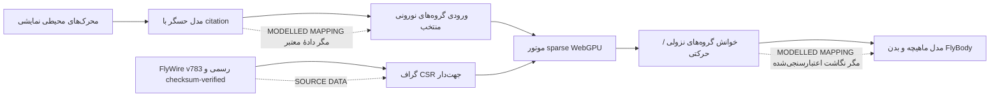

# مسیر فعال‌سازی علمی FlyWire برای My Greatest Sin

## پاسخ کوتاه

فعال‌کردن **دادهٔ عصبی واقعی FlyWire** امکان‌پذیر است، اما به‌تنهایی باعث نمی‌شود حرکت مگس «کاملاً منطبق با واقعیت» شود. FlyWire FAFB v783 یک اتصال‌نگار ساختاریِ ایستا از مغز مگس مادهٔ بالغ است؛ دادهٔ منتشرشده شامل نورون‌های proofread، اتصال‌های جهت‌دار، شمار سیناپس‌ها، نوراپیل و پیش‌بینی ناقل عصبی است، نه ثبت هم‌زمان حس‌های یک مگس زنده، فعالیت الکتروفیزیولوژیک، وضعیت ماهیچه‌ها یا سینماتیک بدن [1] [2].

> برای ادعای علمی درست، باید سه لایه جدا نگه داشته شوند: **توپولوژی عصبی منبع**، **مدل تبدیل حس به ورودی عصبی**، و **مدل تبدیل خروجی عصبی به ماهیچه و بدن**. تنها لایهٔ نخست با بارگذاری مستقیم v783 کاملاً دادهٔ منبع خواهد بود.

## آنچه دادهٔ رسمی فراهم می‌کند

| مؤلفه | وضعیت در v783 | کاربرد در پروژه |
|---|---|---|
| نورون‌های proofread | آرایهٔ `proofread_root_ids_783.npy` برای نورون‌های proofread | شناسه‌گذاری و ساخت گره‌های شبکهٔ رسمی |
| اتصال‌ها | `proofread_connections_783.feather`، خلاصه‌شده بر حسب جفت نورون و نوراپیل | ساخت CSR جهت‌دار و وزن‌گذاری مبتنی بر `syn_count` |
| سیناپس‌ها و ناقل‌ها | جدول synapse، موقعیت، احتمال ناقل و نوراپیل | فیلتر و تحلیل اتصال‌ها؛ نه معادل وزن سیناپسی فیزیولوژیک |
| annotation و نوع سلول | Codex snapshot v783 و دانلودهای static | انتخاب زیرمدارهای حسی، نزولی و حرکتی با ردیابی منبع |

Codex برای تحلیل انبوه، دانلودهای static را توصیه می‌کند، نه اسکرپ‌کردن رابط یا فراخوانی‌های زندهٔ متعدد [1]. نسخهٔ رسمی FAFB در Codex همچنان snapshot **783** با تاریخ اکتبر ۲۰۲۳ است، در حالی که صفحات Codex امکان ارائهٔ annotationهای به‌روزشده‌تر را دارند؛ هر اجرا باید نسخه و هش فایل‌های استفاده‌شده را ثبت کند [1].

## manifest رسمی benchmark

رکورد رسمی Zenodo با DOI `10.5281/zenodo.10676866`، نسخهٔ metadata **783.0**، وضعیت open و مجوز **CC BY 4.0** را برای داده‌های اتصال منتشر می‌کند [4]. برای benchmark کامل این پروژه فقط دو فایل زیر لازم‌اند؛ فایل سیناپس کامل ۹.۴۹ GB برای ساخت CSR proofread الزامی نیست.

| فایل رسمی | اندازه | MD5 رسمی Zenodo | نقش benchmark |
|---|---:|---|---|
| `proofread_root_ids_783.npy` | 1,114,168 B | `e0e6c19732fd8c7a4e39a2d170105421` | فهرست گره‌های proofread |
| `proofread_connections_783.feather` | 852,022,274 B | `f48f972d262323a102aed49af1396b8a` | اتصال‌های خلاصه‌شدهٔ proofread برای CSR |

این اطلاعات باید پیش از تبدیل با checksum محلی دوباره‌سنجی شوند. مجوز رکورد اتصال Zenodo نباید به‌صورت خودکار به همهٔ دارایی‌ها، annotationهای زنده یا داده‌های دیگر FlyWire تعمیم داده شود.

### پیش‌پرواز محیط benchmark — ۲۵ اوت ۲۰۲۶

مرورگر هدف در secure context روی Chromium 151، `navigator.gpu` را پشتیبانی می‌کند. فضای آزاد محلی ۳۶ GB است؛ بنابراین دریافت دو فایل ضروری (حدود ۸۵۳ MB) و مشتق CSR خارج از repository از نظر فضای دیسک ممکن است. این فقط یک **قابلیت‌سنجی** است و نه نتیجهٔ عملکرد: گزارش benchmark باید بعداً adapter واقعی، سقف buffer، زمان upload، latency گام sparse و پایداری renderer را ثبت کند.

### دریافت رسمی و کنترل یکپارچگی — ۲۵ اوت ۲۰۲۶

دو ورودی موردنیاز مستقیماً از endpoint رسمی رکورد Zenodo دریافت شدند و با MD5 منتشرشده کنترل شدند: `proofread_root_ids_783.npy` با اندازهٔ 1,114,168 B و MD5 `e0e6c19732fd8c7a4e39a2d170105421`، و `proofread_connections_783.feather` با اندازهٔ 852,022,274 B و MD5 `f48f972d262323a102aed49af1396b8a`. فایل ناتمام نخستین تلاش جدا نگه داشته شد و در تبدیل وارد نمی‌شود.

### نتیجهٔ benchmark رسمیِ مرورگر — ۲۵ اوت ۲۰۲۶

از دو ورودی کنترل‌شده، یک مشتق CSR با **۱۳۹٬۲۵۵ نورون** و **۱۶٬۸۴۷٬۹۹۷ اتصال** ساخته شد. برای سنجش اولیه، تنها چهار ستون لازم برای گام sparse (`root_id`، offsetهای ورودی، source index و شمار سیناپس) با مجموع حدود ۱۶۳ MiB به storage مدیریت‌شده منتقل شدند و همهٔ chunkها پیش از upload دارای SHA-256 در manifest بودند.

در مرورگر هدف، manifest و ستون‌ها بدون خطای کنسول شروع به دریافت کردند؛ بااین‌حال `navigator.gpu.requestAdapter()` توسط محیط اجرا رد شد. بنابراین **هیچ زمان گام WebGPU، مصرف GPU یا نرخ اجرای معتبر ثبت نشده است** و وضعیت FlyWire درست همچنان `STAGED — NO EXECUTION` است. این نتیجه یک محدودیت محیط benchmark است، نه شکست checksum یا نشانه‌ای از اجرای CPU؛ هیچ fallback اجرا نشد.

## معماری پیشنهادی

### ۱. دریافت و تبدیل رسمی، بیرون از bundle عمومی

فایل‌ها باید فقط از مسیر رسمی Codex/Zenodo دریافت، هش‌گذاری و با manifest نسخه‌دار تبدیل شوند. نسخهٔ خام و مشتقات شامل دادهٔ FlyWire نباید بدون بازبینی مجوز در repository عمومی یا storage عمومی برنامه قرار گیرند. صفحهٔ دادهٔ اتصال‌ها، جدول proofread و جدول connection را توضیح می‌دهد و برای synapse table حدود ۱۳۰ میلیون سیناپس را ذکر می‌کند [3].

### ۲. اجرای sparse واقعی در WebGPU

یک CPU loop برای گراف کامل مناسب نیست. فعال‌سازی باید با benchmark واقعی روی دستگاه هدف شروع شود: تخصیص TypedArray/StorageBuffer، زمان‌سنجی گام، نرخ فریم، مصرف حافظه و بازیابی خطا. فقط اگر گراف رسمی checksum-verified با بودجهٔ حافظه و latency قابل‌قبول اجرا شد، وضعیت `SOURCE DATA / FLYWIRE ACTIVE` مجاز است. تا قبل از آن، HUD باید `STAGED — NO EXECUTION` باقی بماند.

### ۳. نگاشت محیط به مدار حسی

اسلایدرهایی مثل بو، نور و لمس، دادهٔ FlyWire نیستند. برای هر کانال باید جمعیت‌های حسیِ دارای annotation رسمی انتخاب شوند، روش نگاشت، واحدها، دامنه و citation ثبت شوند و در HUD با برچسب `MODELLED SENSOR INPUT` نمایش داده شوند. انتخاب cell type تنها با annotation ثابتِ همان snapshot باید انجام شود؛ Codex هشدار می‌دهد که root IDها و annotationها میان versionها می‌توانند تغییر کنند [1].

### ۴. نگاشت مدار به بدن

خروجی FlyWire از مغز به‌تنهایی مدل کامل ماهیچه و مفصل نیست. یک سطح علمی‌تر می‌تواند گروه‌های descending/motor-identified را بخواند، جهت/شدت را از یک decoder آزمون‌پذیر بسازد و آن را به اسکلت FlyBody منتقل کند. این همچنان `MODELLED MAPPING` است، مگر این‌که برای همان نورون‌ها و همان رفتار، نگاشت منتشرشده و اعتبارسنجی‌شده با دادهٔ رفتاری/عضلانی وجود داشته باشد.

## معیارهای پذیرش پیش از هر ادعای قوی

| ادعا | حداقل شواهد لازم | برچسب صحیح تا پیش از آن |
|---|---|---|
| «اتصال‌نگار واقعی در حال اجرا است» | فایل رسمی، نسخه، manifest، همهٔ checksumها، benchmark و عدم استفاده از fallback | `STAGED — NO EXECUTION` |
| «محیط به شبکهٔ واقعی ورودی می‌دهد» | جمعیت‌های حسی cited، نگاشت نسخه‌دار، آزمون تحریک و گزارش اثر | `MODELLED SENSOR INPUT` |
| «شبکه بدن را کنترل می‌کند» | decoder تعیین‌شده، خوانش نورون‌های مستند، آزمایش ablation/perturbation و تکرارپذیری | `MODELLED MOTOR DECODER` |
| «حرکت کاملاً مطابق واقعیت است» | مدل ماهیچه/بدن و دادهٔ رفتاریِ هم‌سطح با مدار، به‌همراه اعتبارسنجی کمّی | **نباید ادعا شود** مگر با شواهد جدید |

## ترتیب اجرای پیشنهادی

ابتدا benchmark و manifest رسمی را فعال کنید؛ سپس به‌جای کل مغز، یک زیرمدار documented و آزمایش‌پذیر را با `SOURCE DATA` اجرا کنید؛ بعد نگاشت ورودی/خروجی را با citation و آزمون‌های perturbation اضافه کنید؛ و در آخر، فقط در صورتی که دقت حرکت با معیار بیرونی سنجیده شد، دامنهٔ ادعا را گسترش دهید. این ترتیب جلوی تبدیل «گراف واقعی» به یک انیمیشن با برچسب علمی را می‌گیرد.

## پایلوت پیشنهادی: آغاز تغذیه با قند، sugar-GRN → MN9

برای نخستین زیرمدار، مسیر **gustatory receptor neuronهای حسگر قند → مدار تغذیه در SEZ → نورون حرکتی MN9** مناسب‌تر از راه‌رفتن است. Shiu و همکاران یک مدل LIF بر پایهٔ اتصال و پیش‌بینی ناقلِ FlyWire ساختند و نشان دادند تحریک sugar-GRNهای labellar، چند نورون حرکتی خرطوم از جمله MN9 را فعال می‌کند؛ MN9 با بالابردن rostrum در proboscis extension ارتباط دارد [5]. خود مقاله تأکید می‌کند که این مدار حسی تا حرکتی به‌طور کامل در حجم FlyWire وجود دارد، در حالی که مدارهای وابسته به descending neuron برای حرکت بدن در آن حجم ناقص‌اند [5].

در پایلوت برنامه، `SOURCE DATA` شامل شناسه‌های v783، اتصال‌های رسمی و خوانش MN9 خواهد بود. تبدیل اسلایدر «قند» به نرخ تحریک sugar-GRN، و تبدیل نرخ MN9 به حرکت بصری خرطومِ مدل FlyBody، باید جداگانه و با برچسب `MODELLED MAPPING` نمایش داده شوند. این آزمایش به‌درستی یک کنترل حسی–حرکتیِ **خرطوم** است، نه اثبات راه‌رفتن طبیعی یا کنترل کامل شش پا.

### کنترل ساختاری پایلوت در v783

۲۱ شناسهٔ sugar-GRN سمت راست و شناسهٔ MN9 از notebook همراه پژوهش Shiu در برابر `proofread_root_ids_783.npy` آزموده شدند. MN9 و ۲۰ مورد از ۲۱ ورودی در مجموعهٔ proofread حاضر بودند؛ یکی از شناسه‌های ورودی در این snapshot وجود نداشت. اتصال مستقیم sugar-GRN → MN9 در جدول خلاصه‌شده صفر بود، اما query دوگامی **۱۳ واسط ساختاری** را یافت؛ برای نمونه، شناسهٔ واسط `720575940627847752` یک سیناپس از `720575940633143833` و ۷۰ سیناپس به MN9 دارد. این فقط شاهد مسیر ساختاریِ source است؛ نوع سلول واسط، نرخ شلیک، encoding قند و نگاشت MN9 به خرطوم هنوز نباید به‌عنوان دادهٔ منبع یا کنترل زیستی کامل معرفی شوند.

گزارش‌های خواندنیِ این کنترل ساختاری در storage مدیریت‌شده نگهداری می‌شوند: `/manus-storage/sugar-mn9-evidence_06b7fcc1.json` برای حضور شناسه‌ها و آمار مستقیم، و `/manus-storage/sugar-mn9-two-hop_6d3b2fde.json` برای مسیرهای دوگامی. این دو فایل شاهد هستند و بخشی از runtime فعال بدن نیستند.

### وضعیت پیاده‌سازی گیت‌شده

در نسخهٔ فعلی، runtime پایلوت ابتدا هر دو گزارش شاهد را با SHA-256 ثابت بررسی می‌کند، سپس manifest رسمی و چهار ستون `root_id`، `incoming_offsets`، `source_index` و `synapse_count` را با checksum خودشان می‌گیرد. lookup شناسه‌های ۶۴ بیتی تنها با `BigUint64Array` و رشته انجام می‌شود؛ هیچ شناسهٔ FlyWire به `Number` تبدیل نمی‌شود. فقط پس از تأیید حضور MN9 و ۲۰ ورودیِ موجود، `navigator.gpu`، adapter و device بررسی می‌شوند. نبودِ adapter خطای `BLOCKED` می‌دهد و هیچ مسیر CPU یا خروجی بدنی جایگزین ندارد.

در adapter معتبر، kernel چهار گام **structural propagation score** روی CSR رسمی انجام می‌دهد و تنها یک scalar از MN9 می‌خواند. این kernel مدل LIF، نرخ شلیک پیش‌بینی‌شده یا مدل ماهیچه نیست. اسلایدر غذا به injection ورودی sugar-GRN و تبدیل `score / (score + 0.0025)` به چرخش محدودِ `rostrum`، `haustellum` و دو `labrum`، هر دو `MODELLED MAPPING` هستند. ریگ عمداً هیچ دسترسی به حرکت ریشه، گام شش پا یا بال‌ها ندارد.

در مرورگر target همین نسخه، پایلوت تا گیت adapter پیش رفت و `requestAdapter()` رد شد. در نتیجه هیچ score MN9 و هیچ حرکت خرطومِ منبع‌ران تولید نشد؛ HUD به‌درستی `PILOT EXECUTION: ERROR` و علت blocked را نمایش می‌دهد. این محدودیت محیطی، نباید با شکست checksum یا ادعای اجرای کامل FlyWire اشتباه گرفته شود.

## منابع

[1]: https://codex.flywire.ai/faq "Codex: FlyWire FAQ"
[2]: https://flywire.ai/ "FlyWire — Whole-Brain Connectome"
[3]: https://explore.openaire.eu/search/result?pid=10.5281/zenodo.10676866 "FlyWire Whole-brain Connectome Connectivity Data"
[4]: https://zenodo.org/api/records/10676866 "Zenodo API — FlyWire Whole-brain Connectome Connectivity Data, version 783.0"
[5]: https://pmc.ncbi.nlm.nih.gov/articles/PMC11446845/ "Shiu et al. (2024), A Drosophila computational brain model reveals sensorimotor processing"
